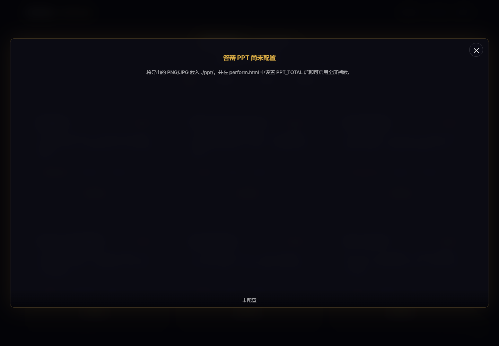

<div align="center">

# 文物智鉴 · ArtiGuide

**深色科技风格展示页面框架 | 适用于项目答辩、产品展示、技术演示**


**[English](./README_EN.md)** | 中文

</div>

---

## 效果预览

<!-- 替换为你的截图路径 -->




---

## 特性

- 粒子动画背景（鼠标可交互）
- 鼠标跟踪光晕 + 3D 卡片倾斜
- Tab 标签页切换 + 滚动触发动画
- PPT 幻灯片全屏展示
- 响应式设计，适配移动端

## 快速开始

```bash
git clone https://github.com/zgy123454zgy-afk/arti-guide-showcase.git
```

直接用浏览器打开 `perform.html` 即可。

## 配置 PPT

1. 将 PPT 导出为图片（PNG/JPG），放入 `./ppt/` 文件夹
2. 修改 `perform.html` 中的配置：

```javascript
const PPT_TOTAL = 10;           // 图片总数
const PPT_PATH = './ppt/';      // 图片路径
const PPT_IMAGES = [];          // 可选：自定义文件名数组
```

> 详细说明见 [`ppt/README.md`](./ppt/README.md)

## 自定义

**颜色主题** - 修改 CSS 变量：
```css
:root {
    --accent-glow: #d4a843;   /* 主强调色 */
    --accent-purple: #2e8b57; /* 次强调色 */
}
```

**内容** - 修改 JavaScript 中的 `dataSources` 和 `features` 数组。

## 技术栈

| 库 | 用途 |
|----|------|
| [tsparticles](https://particles.js.org/) | 粒子动画 |
| [GSAP](https://greensock.com/gsap/) + ScrollTrigger | 动画引擎 |
| [VanillaTilt](https://micku7zu.github.io/vanilla-tilt.js/) | 3D 倾斜 |

## 浏览器兼容

Chrome 80+ · Firefox 75+ · Safari 13+ · Edge 80+

## 部署

**GitHub Pages：** Settings → Pages → Branch: main → Save

**本地运行：**
```bash
python -m http.server 8080
```

## 开源协议

[MIT License](./LICENSE)
