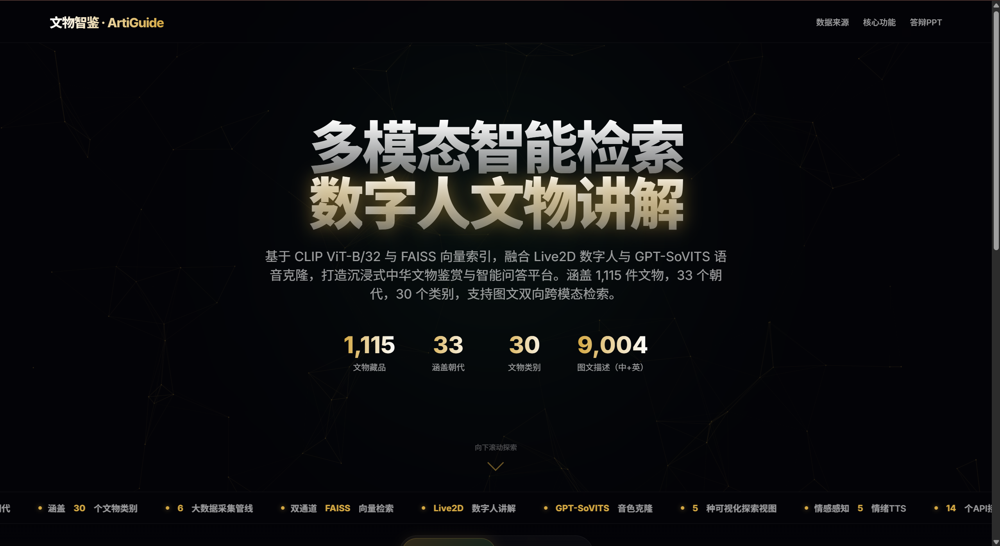
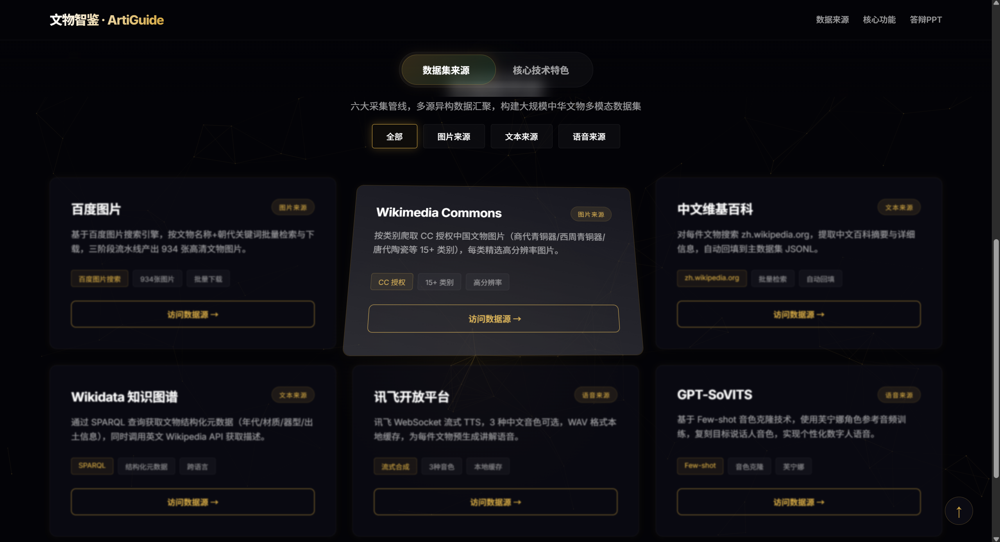

<div align="center">

# ArtiGuide

**Showcase page for a multimodal cultural relic retrieval and digital human narration system**


[中文](./README.md) | **English**

</div>

---

## Overview

`ArtiGuide` is a dark, technology-inspired static showcase page for graduation defenses, project demos, and product presentations. It presents the "Wenwu Zhijian" system, including a multimodal cultural relic dataset, a CLIP + FAISS retrieval pipeline, Live2D digital human narration, speech synthesis, and data visualization modules.

The project does not require a build step. Open [perform.html](./perform.html) directly or serve the folder with a local static server.

## Preview




## Highlights

- **Immersive hero section**: particle background, cursor glow, title animation, and animated metrics.
- **Tabbed content layout**: dataset sources and technical features with category filters.
- **Interactive cards**: 3D tilt, spotlight tracking, ripple feedback, and scroll reveal animations.
- **Fullscreen PPT viewer**: export slides as images and play them inside the page.
- **Static hosting friendly**: single-page HTML structure suitable for GitHub Pages, Netlify, Vercel, and similar platforms.

## Tech Stack

| Technology | Purpose |
| --- | --- |
| HTML / CSS / JavaScript | Page structure, styling, and interaction logic |
| tsparticles | Particle background |
| GSAP + ScrollTrigger | Entrance and scroll animations |
| VanillaTilt | 3D card tilt effect |
| GitHub Pages | Static deployment |

## Quick Start

```bash
git clone https://github.com/zgy123454zgy-afk/arti-guide-showcase.git
cd arti-guide-showcase
python -m http.server 8080
```

Then open:

```text
http://localhost:8080/perform.html
```

You can also open `perform.html` directly in a browser. Using a local server is recommended for more reliable CDN loading.

## Configure PPT

1. Export your defense slides as PNG or JPG images.
2. Place the images inside `./ppt/`.
3. Update the configuration in `perform.html`:

```javascript
const PPT_TOTAL = 10;
const PPT_PATH = './ppt/';
const PPT_IMAGES = [];
```

By default, the viewer loads `1.png`, `2.png`, `3.png`, and so on. For custom filenames, use:

```javascript
const PPT_IMAGES = ['cover.png', 'method.png', 'demo.png'];
```

See [ppt/README.md](./ppt/README.md) for details.

## Customization

- Page copy and cards: edit the `dataSources` and `features` arrays in `perform.html`.
- Theme colors: adjust CSS variables under `:root`, such as `--accent-glow` and `--accent-purple`.
- Preview images: replace `screenshots/hero.png` and `screenshots/cards.png`; optionally add `screenshots/ppt.png`.
- PPT slides: place exported slide images in `ppt/` and update the PPT configuration.

## Project Structure

```text
.
├── perform.html          # Main showcase page
├── README.md             # Chinese documentation
├── README_EN.md          # English documentation
├── ppt/                  # PPT image directory
│   └── README.md
├── screenshots/          # README preview images
│   ├── hero.png
│   ├── cards.png
│   ├── ppt.png             # Optional: PPT modal screenshot
│   └── README.md
└── LICENSE
```

## Deployment

Recommended GitHub Pages setup:

1. Open repository `Settings`.
2. Go to `Pages`.
3. Set Source to `Deploy from a branch`.
4. Select branch `main` and folder `/(root)`.
5. Save the configuration and open `/perform.html` from the generated Pages URL.

## Notes

This repository focuses on the showcase page. It does not include the full backend, model weights, or production database. The page copy summarizes the capability boundary and implementation ideas of the graduation project system.

## License

[MIT License](./LICENSE)
